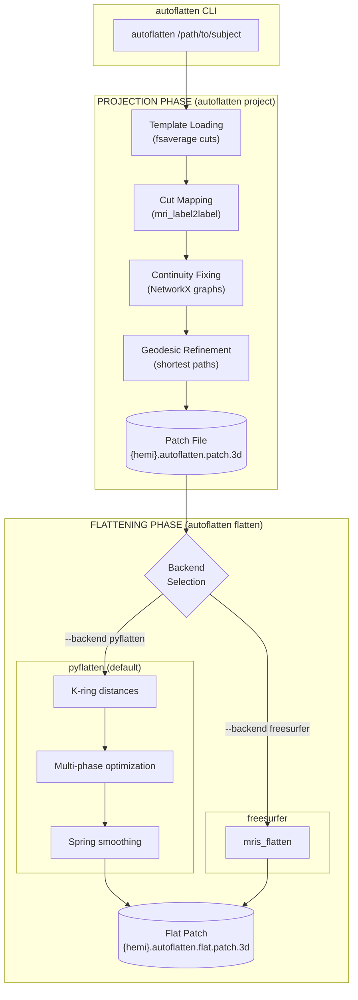

# AutoFlatten: Automatic Cortical Surface Flattening

AutoFlatten is a Python pipeline for automatically creating flattened 2D representations of FreeSurfer cortical surfaces. It maps anatomical cut templates from fsaverage to individual subjects using surface-based registration, then generates FreeSurfer-compatible patch files and runs optimized flattening.

## Features

- **Two flattening backends**:
  - **pyflatten** (default): JAX-accelerated Python implementation with multi-phase optimization
  - **freesurfer**: Traditional FreeSurfer `mris_flatten` wrapper
- **Automatic cut mapping** from fsaverage template to individual subjects
- **Geodesic refinement** for anatomically accurate cuts
- **Parallel hemisphere processing**
- **Visualization** with area distortion metrics

## Architecture



## Requirements

- Python 3.10+
- FreeSurfer 7.0+ (for projection phase only)
  - `FREESURFER_HOME` and `SUBJECTS_DIR` environment variables must be set
  - FreeSurfer binaries must be in PATH

## Installation

### Using uv (recommended)

```bash
# Clone the repository
git clone https://github.com/gallantlab/autoflatten.git
cd autoflatten

# Install with uv
uv pip install .

# With test dependencies
uv pip install ".[test]"

# With CUDA support for GPU acceleration
uv pip install ".[cuda]"
```

### Using pip

```bash
# Clone the repository
git clone https://github.com/gallantlab/autoflatten.git
cd autoflatten

# Install in development mode
pip install -e .

# With test dependencies
pip install -e ".[test]"
```

## Usage

AutoFlatten provides a CLI with four commands:

| Command | Description |
|---------|-------------|
| `autoflatten /path/to/subject` | Full pipeline: projection + flattening |
| `autoflatten project /path/to/subject` | Projection only: create patch file |
| `autoflatten flatten PATCH_FILE` | Flattening only: flatten existing patch |
| `autoflatten plot FLAT_PATCH` | Plot a flattened surface |

### Full Pipeline

Process a subject through the complete pipeline (projection + flattening):

```bash
# Using the default pyflatten backend
autoflatten /path/to/subjects/sub-01 --output-dir /path/to/output

# Use FreeSurfer backend instead
autoflatten /path/to/subjects/sub-01 --backend freesurfer

# Process both hemispheres in parallel
autoflatten /path/to/subjects/sub-01 --parallel

# Process only left hemisphere
autoflatten /path/to/subjects/sub-01 --hemispheres lh
```

### Projection Only

Create patch files without running flattening:

```bash
autoflatten project /path/to/subjects/sub-01 --output-dir /path/to/output

# Skip geodesic refinement (faster but less accurate cuts)
autoflatten project /path/to/subjects/sub-01 --no-refine-geodesic
```

### Flattening Only

Flatten an existing patch file:

```bash
autoflatten flatten lh.autoflatten.patch.3d

# Specify base surface explicitly
autoflatten flatten lh.autoflatten.patch.3d --base-surface /path/to/lh.fiducial

# Customize pyflatten parameters
autoflatten flatten lh.autoflatten.patch.3d --k-ring 25 --n-neighbors 40
```

### Visualization

Plot a flattened surface with quality metrics:

```bash
autoflatten plot lh.autoflatten.flat.patch.3d --subject sub-01
```

## Output Files

For each processed hemisphere, the pipeline creates:

| File | Description |
|------|-------------|
| `{hemi}.autoflatten.patch.3d` | 3D patch file with cuts |
| `{hemi}.autoflatten.flat.patch.3d` | 2D flattened surface |
| `{hemi}.autoflatten.flat.patch.3d.log` | Optimization log (pyflatten) |
| `{hemi}.autoflatten.flat.patch.png` | Visualization plot |
| `{hemi}.autoflatten.projection.log` | Projection phase log |

## How It Works

### Projection Phase

1. **Template Loading**: Load cut definitions from fsaverage template (medial wall + 5 anatomical cuts: calcarine, medial1-3, temporal)

2. **Cut Mapping**: Use FreeSurfer's `mri_label2label` to map template cuts to the target subject via surface-based registration

3. **Continuity Fixing**: Ensure mapped cuts form continuous lines using graph-based algorithms (NetworkX)

4. **Geodesic Refinement** (default): Replace mapped cuts with geodesic shortest paths between endpoints for anatomically accurate boundaries

5. **Patch Creation**: Generate FreeSurfer-compatible binary patch file

### Flattening Phase (pyflatten backend)

1. **K-ring Distance Computation**: Compute geodesic distances to k-hop neighbors using Numba-accelerated Dijkstra

2. **Initial Projection**: Project 3D coordinates onto 2D plane via FreeSurfer-style initialization

3. **Multi-phase Optimization**:
   - Negative area removal (fix flipped triangles)
   - Area-dominant phase (prevent triangle flipping)
   - Balanced phase (equal area/distance weights)
   - Distance-dominant phase (preserve geodesic distances)
   - Distance refinement (fine-tune metric preservation)

4. **Spring Smoothing**: Final Laplacian smoothing for visual quality

## Configuration

### pyflatten Options

| Option | Default | Description |
|--------|---------|-------------|
| `--k-ring` | 20 | K-ring neighborhood size |
| `--n-neighbors` | 30 | Neighbors per ring (angular sampling) |
| `--n-cores` | -1 | CPU cores (-1 = all) |
| `--skip-phase` | - | Skip specific optimization phases |
| `--skip-spring-smoothing` | False | Skip final smoothing |

### FreeSurfer Options

| Option | Default | Description |
|--------|---------|-------------|
| `--seed` | random | Random seed for mris_flatten |
| `--nthreads` | 1 | Number of threads |
| `--distances` | 15 80 | Distance parameters |
| `--n-iterations` | 200 | Maximum iterations |
| `--tol` | 0.005 | Flatness tolerance |

## Available Templates

The package includes built-in templates in `autoflatten/default_templates/`:

- **fsaverage_cuts_template.json** (default): Standard template based on fsaverage, created by Mark Lescroart and Natalia Bilenko
- **SUBJ_A_cut_template.json**: Alternative cut pattern
- **REDACTED_SUBJ_cut_template.json**: Alternative cut pattern

Use a custom template with `--template-file /path/to/template.json`.

## Development

```bash
# Install with test dependencies
pip install -e ".[test]"

# Run tests
pytest

# Run tests with coverage
pytest --cov=autoflatten

# Install pre-commit hooks
pre-commit install

# Run code formatting
ruff format .
```

## License

BSD 2-Clause License. See LICENSE file for details.

## Acknowledgments

- Default fsaverage template cuts by [Mark Lescroart and Natalia Bilenko](https://figshare.com/articles/dataset/fsaverage_subject_for_pycortex/)
- Built on FreeSurfer and PyCortex functionalities
