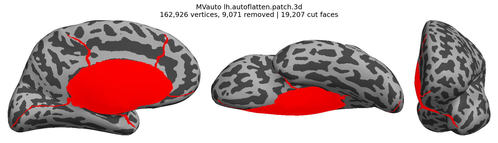
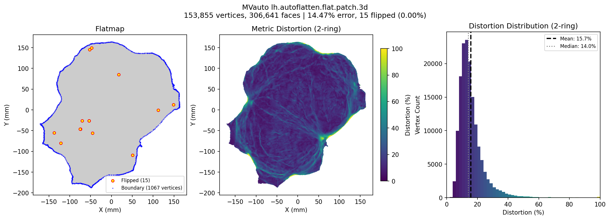

# Example Output

This page shows the output of a basic autoflatten run and explains how to interpret the results.

## Running autoflatten

A minimal run with default parameters:

```bash
autoflatten /path/to/subjects/sub-01
```

By default, output files are saved in the subject's `surf/` directory.

## Output Files

For each hemisphere, autoflatten generates the following files:

| File | Description |
|------|-------------|
| `{hemi}.autoflatten.patch.3d` | 3D patch file with cuts applied |
| `{hemi}.autoflatten.flat.patch.3d` | 2D flattened surface |
| `{hemi}.autoflatten.flat.patch.3d.log` | Optimization log with metrics |
| `{hemi}.autoflatten.patch.png` | 3D projection visualization |
| `{hemi}.autoflatten.flat.patch.png` | 2D flatmap visualization |
| `{hemi}.autoflatten.projection.log` | Projection phase log |

## Projection Visualization

The projection plot (`{hemi}.autoflatten.patch.png`) shows the 3D surface with cuts highlighted in red from three views (medial, ventral, frontal):



The title shows the number of vertices, removed vertices (cuts), and cut faces.

## Flatmap Visualization

The flatmap plot (`{hemi}.autoflatten.flat.patch.png`) shows a three-panel figure:



**Left panel: Flatmap**

- Gray mesh shows the flattened cortical surface
- Yellow/orange dots mark flipped triangles (ideally < 0.05% of faces)
- Blue dots show boundary vertices

**Center panel: Metric Distortion**

- Per-vertex distortion showing % error between 2D and 3D geodesic distances
- Lower values (darker) = better distance preservation

**Right panel: Distortion Distribution**

- Histogram with mean (black dashed) and median (gray dotted) lines

**Title metrics:** vertex/face count, mean % error, flipped count and percentage.

!!! note "Two different error metrics"
    The **title** shows the mean % error computed using the same neighborhood structure as the flattening algorithm (7-ring with angular sampling of 12 vertices, by default). The **histogram** shows distortion computed with a simpler, faster 2-ring neighborhood for visualization purposes.

## Log File Contents

The log file (`{hemi}.autoflatten.flat.patch.3d.log`) contains detailed optimization progress. Here's an annotated example:

### Header

```
Running pyflatten backend
  Input patch: .../surf/lh.autoflatten.patch.3d
  Base surface: .../surf/lh.fiducial
  Output: .../surf/lh.autoflatten.flat.patch.3d
  K-ring: 7, neighbors/ring: 12
```

Shows input/output files and k-ring parameters used for geodesic distance computation.

### Mesh Statistics

```
Loading cortical surface patch...
Mesh: 153,855 vertices, 306,641 faces
Euler characteristic: 1, Boundary vertices: 1067
Original 3D patch surface area: 85792.87
```

Basic mesh information. Euler characteristic of 1 confirms a disk topology (required for flattening).

### K-ring Distance Computation

```
Computing 7-ring geodesic distances with angular sampling (12/ring)...
Computing 7-ring neighbors by level...
Computing vertex normals...
Angular sampling (12 per ring)...
Average neighbors per vertex: 75.3 (max possible: 84)
Distance constraints: 11,583,235 edges, avg 75.3 neighbors/vertex
```

Shows the geodesic distance computation progress. These distances are used as constraints during optimization.

### Optimization Progress

```
=====================================================================================
FREESURFER-STYLE OPTIMIZATION (Vectorized Quadratic Line Search)
=====================================================================================
Initial projection: 114607 flipped triangles
Initial energies: J_d=620597888.0000, J_a=207523.7344
```

The optimization starts with many flipped triangles from the initial 2D projection.

```
=====================================================================================
NEGATIVE AREA REMOVAL (Vectorized Quadratic Line Search, FreeSurfer v6.0.0 convergence)
=====================================================================================

--- Pass 1/5: l_nlarea=1.0, l_dist=1e-06, flipped=114607 (37.37%) ---
  J_d=620597888.0000, J_a=207523.734375, schedule=[1024, 256, 64, 16, 4, 1, 0]
   Iter  n_avg        J_d        J_a    relΔSSE      alpha  Flipped    %err
  ----------------------------------------------------------------------------------------
      1   1024 465559392.0000 40410.1289   0.00e+00   1.63e+04    71135  142.0%
      2   1024 417951104.0000 17910.5137   5.52e-01   4.21e+03    28550  132.3%
      ...
```

Multiple passes with increasing `l_dist` weight progressively reduce flipped triangles while preserving geodesic distances:

- **J_d**: Distance energy (preserving geodesic distances)
- **J_a**: Area energy (preventing flipped triangles)
- **n_avg**: Gradient smoothing window size
- **relΔSSE**: Relative change in energy (convergence criterion)
- **alpha**: Step size from line search
- **Flipped**: Number of flipped triangles
- **%err**: Mean percentage distance error

### Spring Smoothing

```
=====================================================================================
FINAL SPRING SMOOTHING (FreeSurfer-style)
=====================================================================================
  n_iterations=5, dt=0.5, max_step=1.0
  Before: 22 flipped, 14.69% distance error
  Iter 1: 8 flipped, 14.48% err
  ...
  After: 15 flipped, 14.47% distance error
```

Final Laplacian smoothing pass for visual quality.

### Final Result

```
=====================================================================================
FINAL RESULT
=====================================================================================
Flipped triangles: 114607 -> 15
Mean % distance error: 14.47%
Total elapsed time: 11m 38.3s
```

Summary showing the reduction in flipped triangles and final distance error.
